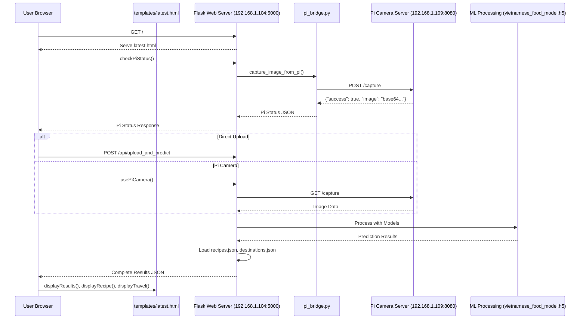

# PBL5 - Vietnamese Food Recognition and Travel Guide

## 📌 Overview

This project implements a hybrid edge-cloud system combining **Raspberry Pi-based image capture** with **machine learning food recognition**, **recipe lookup**, and **travel information display**.

Users can upload food images via a web interface or capture them directly from a Pi camera. The system then identifies the Vietnamese dish, shows recipe steps, and recommends related travel destinations.

---

## 🗂️ Relevant Source Files

- `Pi_client/camera_handler.py`
- `config.py`
- `esp_status.py`
- `pi_bridge.py`
- `templates/latest.html`
- `README.md`
- `LICENSE`

---

## 🎯 Purpose and Scope

This system enables:

- Food recognition via a trained ML model.
- Cross-referencing with JSON datasets to retrieve:
  - Recipes
  - Regional landmarks
- A unified frontend for:
  - Local file uploads
  - Pi camera control
  - ML result visualization

---

## 🏗️ System Architecture Overview

The system is organized into three tiers:

### 1. Edge (Raspberry Pi):
- Captures images via PiCamera2
- Sends images to the server for prediction

### 2. Web Server:
- Receives images
- Runs dual-model inference (Keras .h5 models)
- Serves recipe and travel data

### 3. Frontend:
- Browser-based UI (`latest.html`)
- Tab-based navigation
- Live image preview and results

📡 Communication: HTTP + Flask API + multipart/form-data

---

## 🌐 Network Communication Flow



---

## 🧩 Core Components

### ⚙️ Configuration: `config.py`

| Component | Keys |
|----------|------|
| Paths | `BASE_DIR`, `UPLOAD_FOLDER`, `MODEL_PATHS`, `RECIPES_PATH`, `DESTINATIONS_PATH` |
| Network | `HOST`, `PORT`, `WEB_SERVER_URL`, `PI_BASE_URL` |
| Model | `IMG_SIZE = 224x224` |

---

### 📸 Edge Layer: Raspberry Pi

- File: `Pi_client/camera_handler.py`
- Features:
  - Camera initialization and capture
  - Sends image to server
  - Background thread for button triggering

---

### 🖥️ Web Interface: `latest.html`

| Feature | JS Function |
|--------|-------------|
| Image Upload | `handleFileSelect()`, `setupFileUpload()` |
| Pi Camera | `checkPiStatus()`, `usePiCamera()` |
| Prediction | `analyzeImage()`, `displayResults()` |
| Recipes | `displayRecipe()`, `normalizeKey()` |
| Travel Info | `displayTravel()`, `initVietnamMap()` |

---

## 🧠 Data Processing Pipeline

1. **Image Upload**
2. **Dual Model Prediction**
3. **Key Normalization**
4. **Recipe + Travel JSON Lookup**
5. **Display Results on UI**

---

## 📊 Status Management

- File: `esp_status.py`
```python
esp_status = {
  "status": "startup",  # or 'recognizing', 'recipe', 'travel'
  "dish": "",
  "region": ""
}
```

---

## 🧰 Tech Stack Summary

| Layer | Technology |
|-------|------------|
| Edge | Flask (Pi), Picamera2, OpenCV |
| Web | Flask, TensorFlow, PIL |
| Frontend | HTML5, Bootstrap, JS, Leaflet |
| ML | Keras (.h5), Classification |
| Data | JSON (`recipes.json`, `destinations.json`) |
| Communication | HTTP, CORS, Multipart Form |

---

## 📜 License

See [LICENSE](./LICENSE) for full licensing details.

